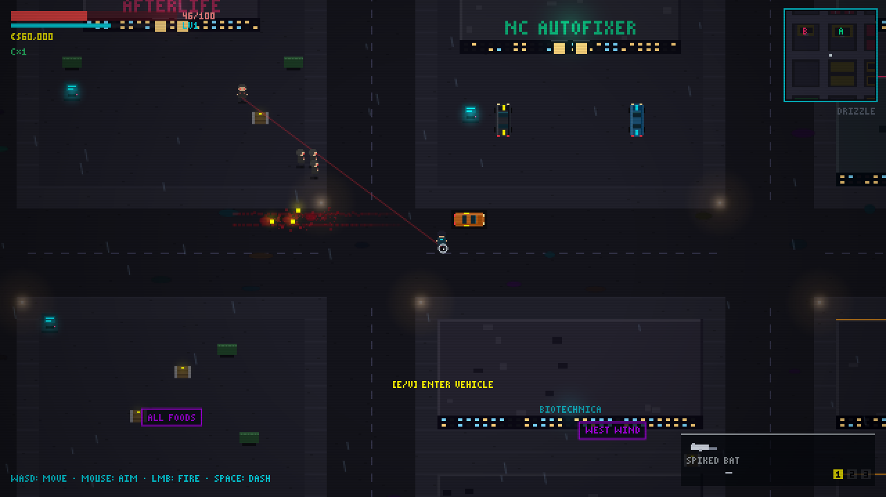
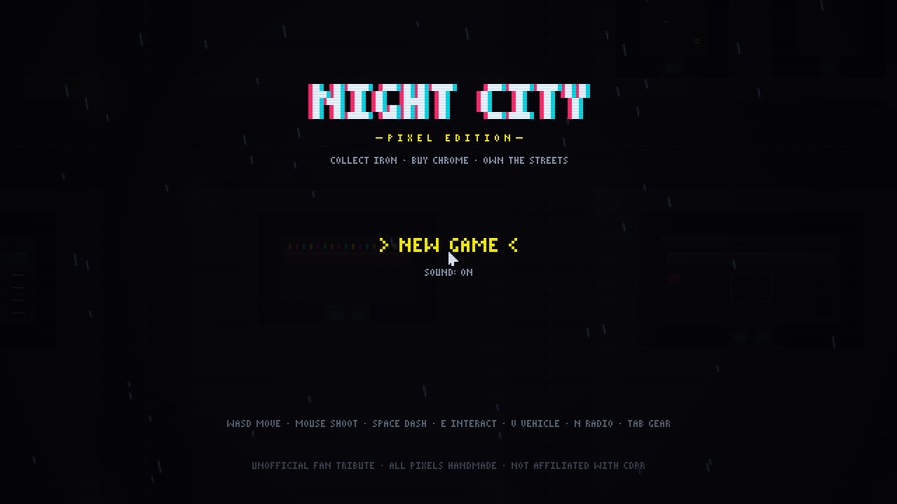
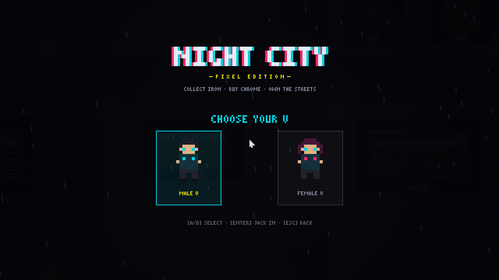
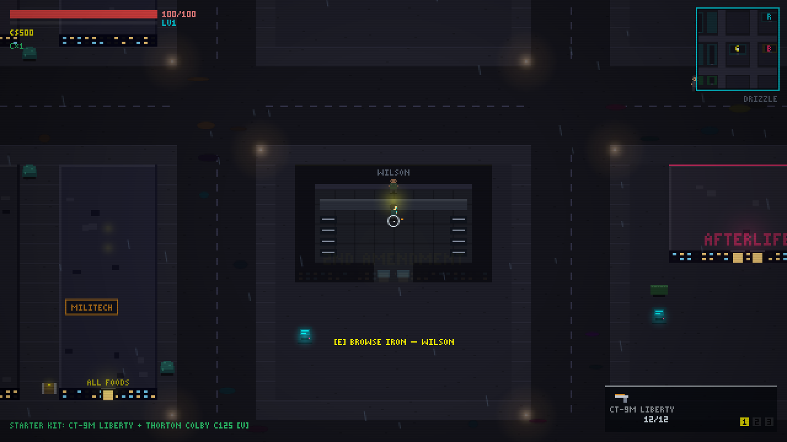
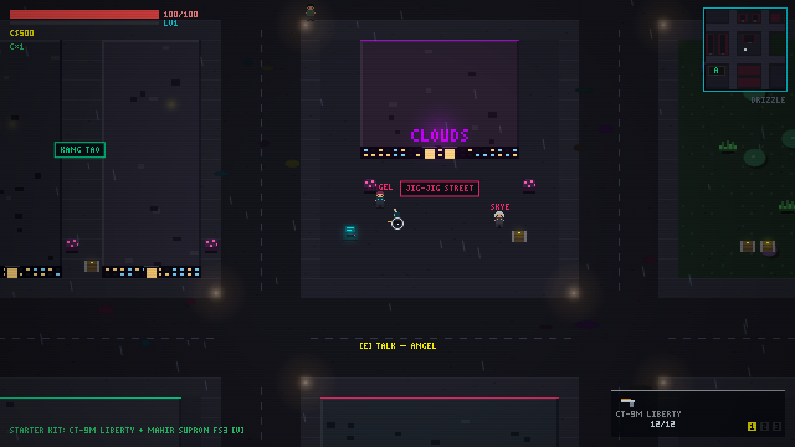
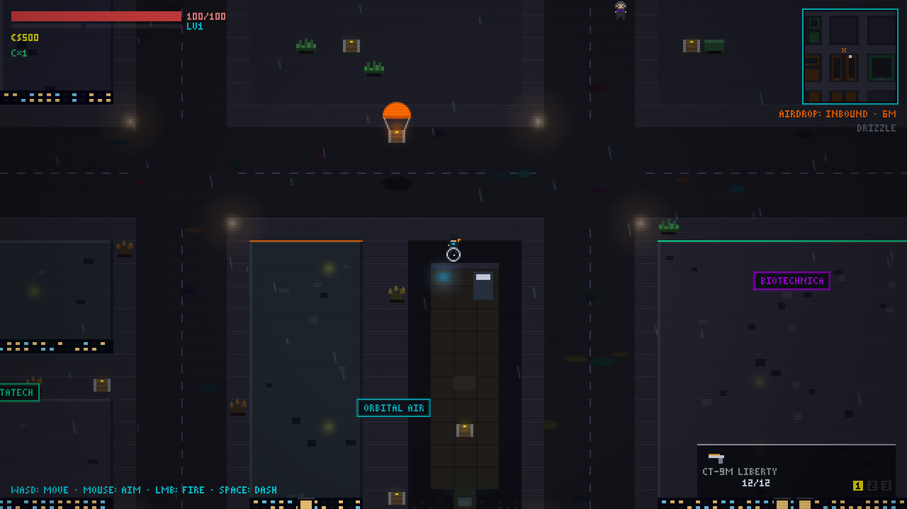
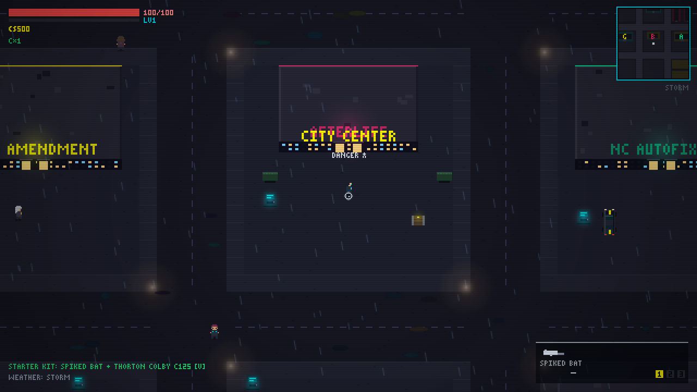

<h1 align="center">🌃 NIGHT CITY — Pixel Edition</h1>

<p align="center"><b>Collect iron. Buy chrome. Own the streets.</b><br>
A pixel-art cyberpunk action RPG that runs entirely in your browser —<br>
zero dependencies, zero asset files, one neon-soaked city generated from code.</p>

<p align="center">
  
  
  
  
  
</p>

<p align="center"></p>
<p align="center"><i>Run a Scav pack over at full speed — the blood stays on the asphalt, the loot is yours.</i></p>

## What you do

Pick your V, roll a random starter kit, and work Night City: hunt **bounties**, take down
**cyberpsychos** for one-of-a-kind iconic weapons, crack **gang hideouts** and **loot crates**,
race the Barghest to **Militech airdrops** over Dogtown — then spend every eddie at the
gun store, the autofixer, and the ripperdoc.

- 🔫 **39-weapon database** — power / tech (piercing) / smart (homing) classes, 8 cyberpsycho-only
  iconics, a hidden talking pistol, and 4 cyber-arm weapons (Mantis Blades, Gorilla Arms, Monowire, launcher)
- 🚗 **12 vehicles** with drift physics, full-body run-over combat, blood decals, and street delivery on **V**
- 🦾 **17 cyberware implants** — Sandevistan bullet-time, Berserk, Kerenzikov, Optical Camo,
  Second Heart, Smart Link, and more, most with 3 upgrade marks
- 👁 **Real stealth** — enemies have view cones, wall occlusion, suspicion meters, and last-known-position
  searches; melee takedowns hit 2.5×; dive into district flora to vanish from sight
- 🏢 **Enterable buildings** — GTA-style roof reveal, walk-in shops with vendors, furnished interiors, gang dens
- 🌧 **Random weather** — clear nights, storms, fog, acid drizzle, smog; fog genuinely shortens enemy vision
- 📻 **5-station MIDI radio**, joytoys & the CLOUDS dollhouse, six districts with their own gangs and danger ★ ratings
- 💾 Autosaves to localStorage · 🧩 **mod API** so players become creators

## Gallery

| | |
|:---:|:---:|
| <br><i>Jack in</i> | <br><i>Choose your V</i> |
| <br><i>Walk-in shops: Wilson's gun racks</i> | <br><i>Jig-Jig Street & the CLOUDS dollhouse</i> |
| <br><i>Militech airdrop inbound over Dogtown</i> | <br><i>Storm over the City Center</i> |

## Run it

```bash
git clone https://github.com/yeahdongcn/night-city-pixel && cd night-city-pixel
./run.sh                      # serves on http://localhost:8080
# or: python3 -m http.server 8080   ·   or: npx serve .   ·   or just open index.html
```

Desktop browser, keyboard + mouse. Click once to enable audio.

## Controls

| Key | Action | Key | Action |
|---|---|---|---|
| WASD | Move / drive | Q | OS ability (Sandevistan / Berserk) |
| Mouse + LMB | Aim / fire / swing | F | Optical camo |
| Space | Dash (handbrake in car) | C | MaxDoc heal |
| R | Reload | E | Interact |
| 1/2/3 · wheel | Weapon slots | V | Summon / enter / exit vehicle |
| N | Radio dial | TAB | Inventory · collections · stats |
| M | Mute | ESC | Pause |

## Mods — players become creators

The game ships with a mod loader: edit **`mods/mods.js`**, refresh, done. Add weapons,
vehicles, cyberware, radio stations, and event hooks — they appear in the shops, the
collection database, the garage, and on the radio dial. No build step.
Full API + a working sample mod: **[MODDING.md](MODDING.md)**.

## Contributing — humans *and* AI agents welcome

This game was built almost entirely by an AI coding agent (Claude) pair-programming with a
human director — so AI-assisted and fully agentic PRs aren't just tolerated here, they're
the house style. Bring your own agent.

- **Agents:** read **[AGENTS.md](AGENTS.md)** first — project map, invariants, and the rules
  that keep saves and determinism intact.
- **Everyone:** `node test/smoke.js` must stay green, keep the zero-dependency /
  zero-binary-asset rule (all art and audio are procedural), and bump the `?v=` cache
  version in `index.html` when you ship.
- Content additions (weapons/cars/stations) are usually better as **mods**; engine PRs
  should come with smoke-test coverage.

## Tech notes

- 640×360 internal canvas, HiDPI-aware integer scaling (`image-rendering: pixelated`), custom 3×5 bitmap font.
- 128×128-tile city pre-rendered to offscreen canvases (deterministic seed so saves stay valid);
  per-building fading roof layers for interiors; two-pass entity rendering for correct facade depth.
- WebAudio: every sound synthesized; the radio is one 64-step sequencer driven by station data.
- `node test/smoke.js` — headless simulation of every system (combat, stealth, shops, driving,
  psychos, airdrops, weather, save/load) against stubbed DOM/canvas.
- Debug URLs: `?autostart`, `?demo`, `?charsel`, `?indoor`, `?jigjig`, `?airdrop`, `&wx=storm|fog|acid|…`, `&v=f`.

## License

MIT (see [LICENSE](LICENSE)). **Unofficial fan tribute** inspired by Cyberpunk 2077 — not
affiliated with or endorsed by CD PROJEKT RED. All code, pixel art, and audio are original;
in-universe names appear in a non-commercial fan context.
